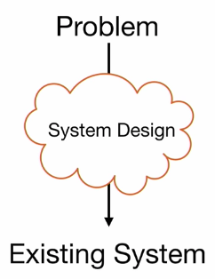

# Week 5 - 01. System Design

## Learing goalds

1. Remember the eight issues of the system design activities
2. Understand the transformation from analysis to design
3. Understand the issues design goals, subsystem decomposition and hardware/software mapping

## Motivation - Why is design so difficult?
* Analysis: focuses on the apllication domain
* Design: focuses on the solution domain
 * The solution domain is changing very rapidly
 * Halftime knowledge in software engineering: 3-5 years __*"also called half-life of knowledge"*__
 * Cost of hardware rapidly sinking

 
## The scope of system design

* Bridge the gap between a problem and an existing system in a manageable way
* How? Divide & Conquer
  * Identify design Goals
  * Model the new system design as a set of subsystems
  * Addres the major design goals

 !
