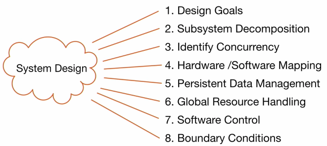
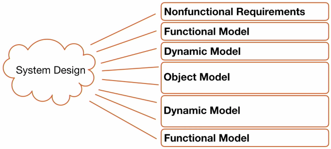
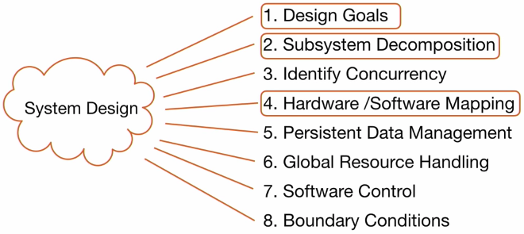
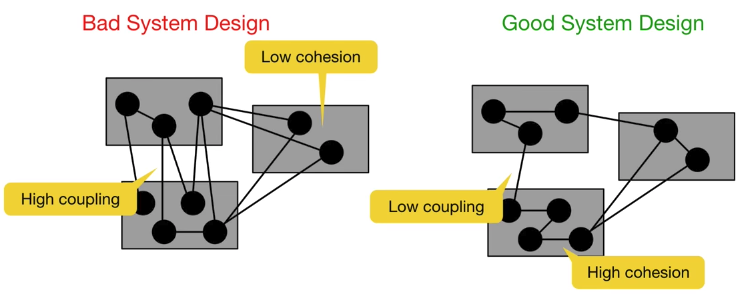
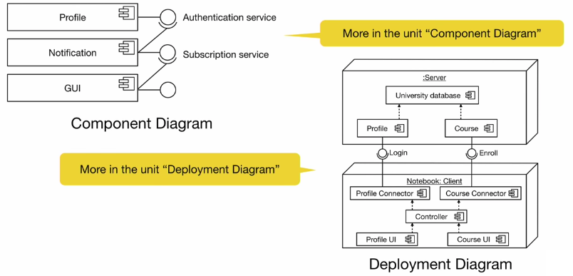

# Week 5 - 01. System Design

## Learning goals

1. Remember the eight issues of the system design activities
2. Understand the transformation from analysis to design
3. Understand the issues design goals, subsystem decomposition and hardware/software mapping

## Motivation - Why is design so difficult?

* Analysis: focuses on the apllication domain
* Design: focuses on the solution domain
    * The solution domain is changing very rapidly
    * Halftime knowledge in software engineering: 3-5 years __*"also called half-life of knowledge"*__
    * Cost of hardware rapidly sinking

 
## The scope of system design

* Bridge the gap between a problem and an existing system in a manageable way
* How? Divide & Conquer
    * Identify design Goals
    * Model the new system design as a set of subsystems
    * Addres the major design goals

## System Design: Eight Issues

### In this course we cover ...

## Design Goals

* Design goals govern the system design activities
* Any nonfunction requirement is a design goal
* Addition stakeholder goals are formulated with respecto to:
    * Design methodology
    * Design metrics
    * Implementation goals
* Design goals ofter conflict with each other

### Typical design goal trade-offs

* Functionality vs Usability
* Cost vs Robustness
* Efficiency vs Portability
* Rapid development vs Functionality
* Cost vs Reusability
* Backward compatibility vs Readability

#### Example: Functionality vs Usability

Is a system with 100 functions usable?

Some systems are not even usable with two functions.

#### Example: Cost vs Reusability

Assume you model the association between 2 classes with an 1-1 multiplicity

* Easy to code, low cost tests, not very reusable

Moving from 1-1 association to a many-many association

* Additionl coding and testing costs

> With design patters this trade-off is no longer painful. You can achive reusability with low cost if you use design patterns.
 
## Subsystem and Services
**Subsystem**

* Collection of classes, associations, operations, events that are closely interrelated with each other
* The classes in the objects model are the seeds for subsystems

**Service**

* A group of externally visible operations provided by a subsystem (also called subsystem interface)
* The use cases in the functional model provide the "seeds" for services

## Coupling and coherence of subsystems
Goal: Reduce system complexity while allowing changes

**Coherence** (measures dependency among classes)

* High coherence: classes in the subsystem perform similar tasks and are related to each other via many associations
* Low coherence: lots of miscellaneous and auxiliary classes, almons no associations

**Coupling** (measures dependency among subsystems)

* High coupling: changes to one subsystem will have high impact on other subsystems
* Low coupling: a change in one subsystem does not affect any other subsystem

**GOOD SYSTEM DESIGN**

* High coherence: classes in the subsystem perform similar tasks and are related to each other via many associations
* Low coupling: a change in one subsystem does not affect any other subsystem

## Cohesion and coupling measure interdependeces
Cohesion measures the interdependence ot the elements of one subsystems.

Coupling measures the interdependence between different subsystems.

## How to achive high coherence and low coupling
*(Coherence=Cohesion)*

**High coherence** can be achived if most of the interactions is within subsystems, rather than across subsystem boundaries.

**Low coupling** can be achived if a calling class dows not need to know anything about the internals of the called class.

## Architectural style vs Architecture

**Subsystem decomposition**

Identification of subsystems, services and their relationship to each other

**Architectural style**

A pattern for a subsystem decompostion

*(More about this in the unit Architectural Patterns)*

**Software architecture**

Instance of an architectural style

## Hardware/Software mapping
Hardware/software mapping address two questions:

1. How shall we realize the subsystems: with hardware or with software?
2. How do we map the object onto chosen hardware and/or software?

## Two UML Diagram Types

