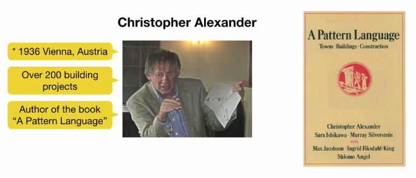
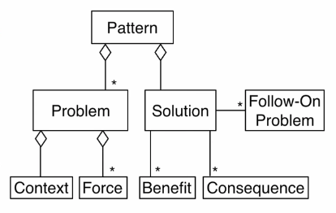

# Week 5 - 02. Patterns

## Learning goals

1. Understand why patters are useful in software engineering
2. Analyse the difference between a pattern and an algorithm
3. Remember the categorization of patterns

## Algorithm vs Pattern

**Algorithm**

* A method for __*solving a problem*__ using a __*finite sequence*__ of __*well-definde instruction*__ for soling a problem
* Starting for an initial state, the algorithm proceeds

**Pattern**

> A pattern __*describes a problem*__ which __*occurs over and over again*__ in our environment, and then __*describes the core of yhe solution*__ to that problem in such a way that you can __*use this solution a million times over, without ever doing it the same way twixw*__
> 
> *Cristopher Alexander, A pattern language.*

## Pattern definition

####Original definition (Christopher Alexander)

A pattern is a three-part rule, which expresses a relation between a certain **context**, a **problem**, and a **solution**.

## Patterns originated in architecture

## Pattern definition 

*  pattern has a __*problem*__ and a __*solution*__
    * The problem class is elaborated in terms of a __*context*__ and a set of __*forces*__
    * The solution resolves these forces tieh __*beneficts*__ and __*consequences*__
    * To be considered as a pattern, the solution must be applicable to more then one specific problem

* Solutions usually generate __*follow-on problems*__
    * Follow-on problems can again be elaborated in terms of __*context*__ and __*forces*__ which may lead to the applicability ot other patterns
    

## 3 Schemata for describing pattrens

1. Alexandrian form (architecture)
2. Gang of four: name, intent, also known as, motivation, applicability,...
    * *Erich Gamma* et. al [Book](https://www.amazon.com/Design-Patterns-Elements-Reusable-Object-Oriented/dp/0201633612)
3. Gang of five: name, also known as, example, context, problem,...
    * *Frank Buschmann* et. al [Book](https://www.amazon.com/Pattern-Oriented-Software-Architecture-System-Patterns/dp/0471958697)

    
## Categorization used for this course

**Patterns for development activities**

* Analysis
* Architecture
* Design
* Testing

**Patterns for cross-function activities**

* Process
* Agile
* Build and release management

**Antipatterns**

* Smells & refactorings
