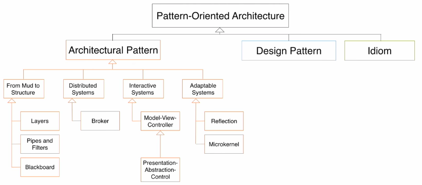

# Week 5 - 03. Architectural Patterns

## Learning goals

1. Understand the comcept of architectural patterns and how to apply them during system design
2. Apply the Layer pattern
3. Understand the Client-Dispatcher-Server pattern
4. Unserstand the MVC architectural style

## Architecture is an Art
Inventing a novel architecture is a highly creative act

**Requires:**

* Knowledge of existing work
* Experience

## Architectural Styles for Buildings

* Style defines main components/layout
* Architect picks an architectural style based on customer requirements
* Architect changes details according to customer requirements
    * Enables reuse of established engineering knowledge

> We apply the same approach to software architecture

## Terminology: Architectural Pattern vs. Architectural Style
Buschmann and his colleagues see the following differences between these terms

* Architectural styles only describe the overall structural frameworks for applications
* Architectural patterns define the basic structure of an applications
* Architectural styles are independent from each other, a pattern dependes on smaller patterns
* Patterns are more problem oriented than architectural styles

We use the terms interchangeably

* **Architectural Style = Architectural Pattern**: A pattern for a subsystem decomposition
* **Software Architecture**: Instance of an architectural style (architectural pattern)

## Elements of Software Architecture

**Components** (Subsystems)

* Computational units with specified interfaces
* Examples: filters, databases, layers, objects

**Connectors** (Communication)

* Interaction between the components(subsystems)
* Protocols that define how the components interact
* Example: method calls, pipes, event broadcasts, shared data

## Pattern-Oriented Architecture
_("Gang of Five" Taxonomy)_

.
.
.

.
.
.

## Layer Pattern
_(Example: 7 Layer of the OSI Model)_

## The Layers of the T.H.E. System

"An operating system is an hierarchy of layers, each layer using services offered by the lower layers"

 
Layers|
---
Layer 4: User Programs|
Layer 3: I/O Device Manager|
Layer 2: Communication Between OS and Console|
Layer 1: Pager|
Layer 0: Scheduler|

### Closed (opaque) vs. Open (transparent) Architecture

**Closed Architecture**

* Each layer can only call operations from the layer below
* Design Goals:
    * Flexibility
    * Testability
    * Maintainability

**Open Architecture**

* Each layer can call operations from any layer
* Design Goals:
    * Runtime efficiency
    

### Pros and Cons of the Layer Patterns

**Pros (Benefits)**

* Reusability of Layers, especially in a closed architecture
* Support fot standardization
* Low coupling
* Improves testability

**Cons (Liabilities)**

* A local change in a lower layer may require rework in higher layers
* Lower efficiency

## Model View Controller

The MVC architectural style decouples data access and data presentation.

