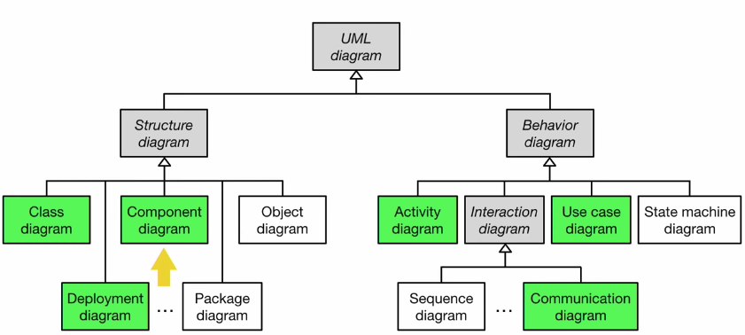
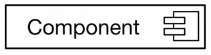
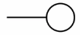
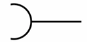
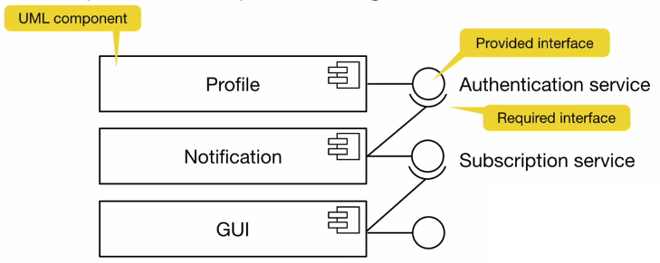
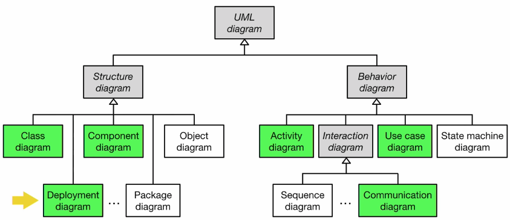
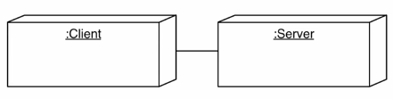
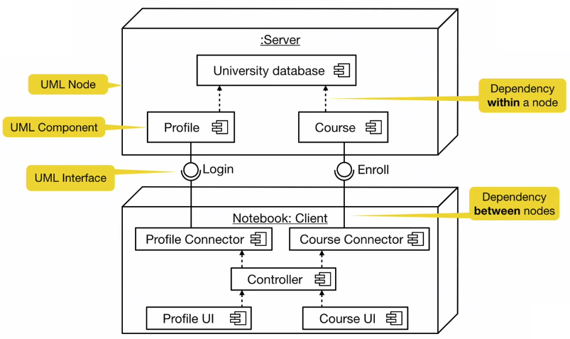

# Week 5 - 04. UML Component and Deployment Diagram

## UML diagrams in EASE - Component

## Purpose of Component Diagrams

* Model the top-level view of the system design in terms of **components** and dependencies among these components

* Dependencies are **connectors** from the client component to the supplier component
* Component diagrams are informally also called _"software wiring diagrams"_ because they show how the components are wired together in the application

## UML Interfaces: Lollipops and Sockets

An interface describes a group of operations **provided** or **requires** by a component.

* A **provided interface** is modeled using the lollipop notation

* A **required interface** is modeled using the socket notation

A port specifies a distinct interaction point between the component and its environment

* Port are depicted as small squares on the side of the classifiers

## Example of a Component Diagram

## UML diagrams in EASE - Deployment

## UML Deployment Diagram

Useful for showing the system design after decisions have ben made:

* Subsystem decomposition
* Hardware/software mapping

Graph of nodes and connections *("communication associations")*

* Nodes represent hardware components or execution environments and are shown as 3D boxes
* Connection between nodes as shown as solid lines
* Nodes may contain software components

### Example

